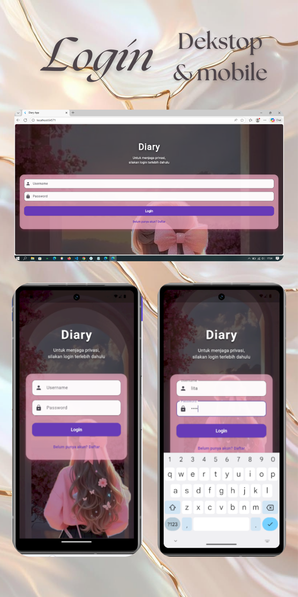
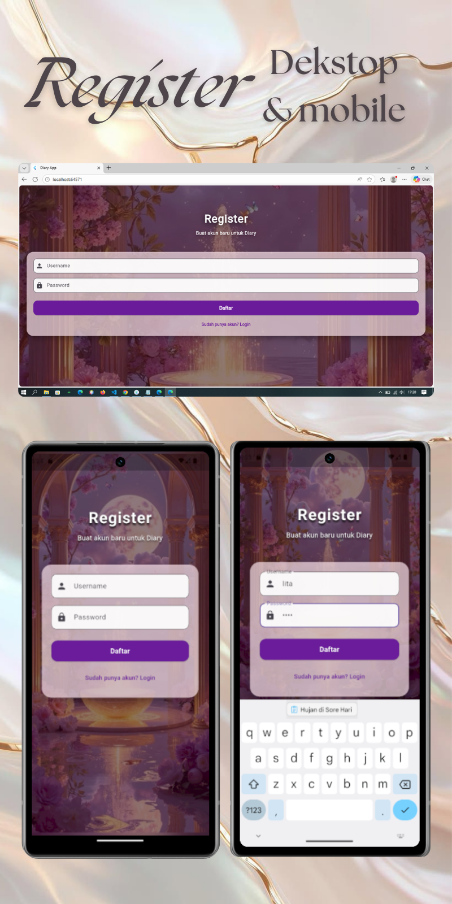
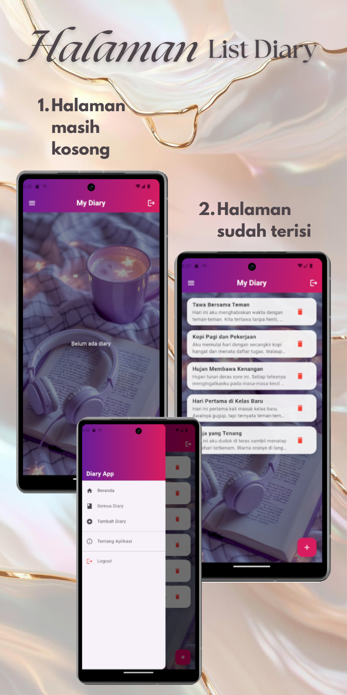
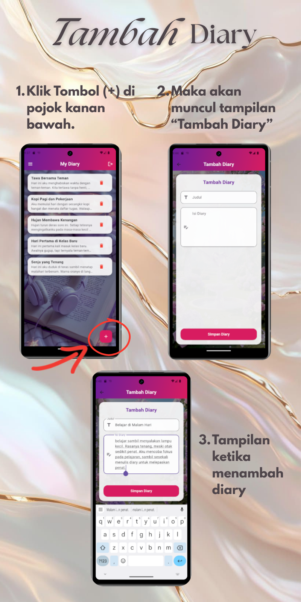
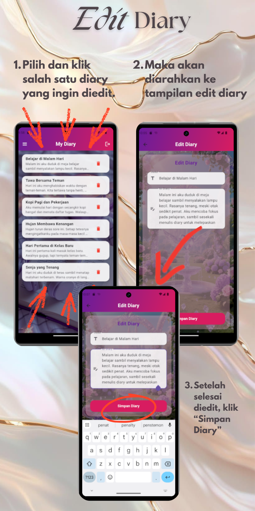
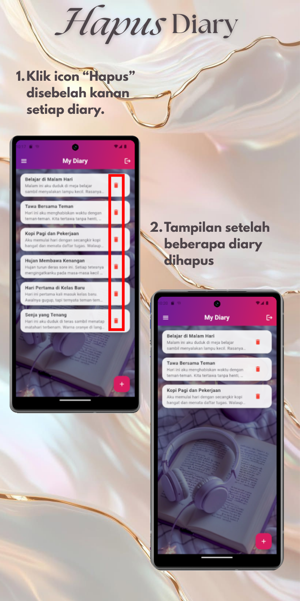
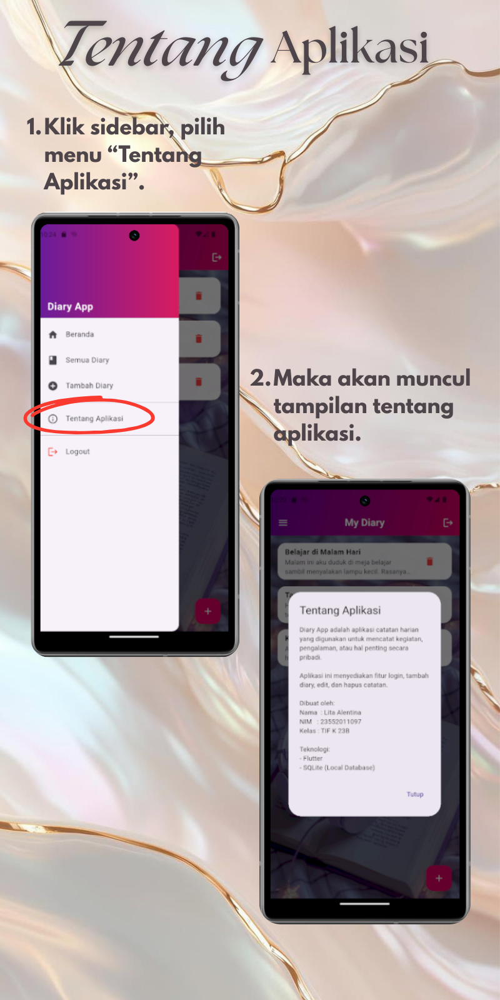

# 🌸 Diary App – Flutter CRUD Application

## Screenshot Aplikasi

### 1️⃣ Halaman Login
Halaman awal aplikasi yang digunakan pengguna untuk masuk ke aplikasi.
Pengguna memasukkan username dan password yang telah dibuat sebelumnya.

Jika data sesuai, pengguna akan diarahkan ke halaman utama aplikasi.
Status login pengguna kemudian disimpan menggunakan SharedPreferences untuk menjaga sesi login selama aplikasi digunakan.

---

### 2️⃣ Halaman Register
Halaman untuk **mendaftarkan akun baru**.  
Data username dan password disimpan secara lokal menggunakan SharedPreferences, 
tanpa memerlukan koneksi internet.

---

### 3️⃣ Halaman List Diary
Halaman ini menampilkan **daftar seluruh diary** yang telah dibuat oleh pengguna setelah berhasil login.

Data diary pada halaman ini:
- **Diambil dari database lokal SQLite** menggunakan package **sqflite**
- Ditampilkan dalam bentuk **list** berdasarkan waktu pembuatan (terbaru di atas)

Pada halaman ini, pengguna dapat:
- 📖 Melihat isi diary
- ✏️ Mengedit diary yang sudah ada
- 🗑️ Menghapus diary yang tersimpan

📌 **Halaman List Diary menggunakan SQLite (sqflite) sebagai media penyimpanan data diary**  
📌 **SharedPreferences tidak digunakan pada halaman ini**, kecuali untuk memastikan status login pengguna

---

### 4️⃣ Halaman Tambah Diary
Halaman ini digunakan untuk **menambahkan diary baru** berupa judul dan isi catatan yang ditulis oleh pengguna.

Pada halaman ini:
- Pengguna mengisi **judul diary** dan **isi catatan**
- Data yang dimasukkan akan **disimpan ke database lokal SQLite** menggunakan package **sqflite**

Setelah diary berhasil ditambahkan:
- Data akan tersimpan secara **permanen di database lokal**
- Diary baru akan langsung muncul pada **Halaman List Diary**

📌 **Penyimpanan data diary menggunakan SQLite (sqflite)**  
📌 **Aplikasi berjalan secara offline tanpa koneksi internet**

---

### 5️⃣ Halaman Edit Diary
Halaman ini digunakan untuk **mengubah data diary** yang telah tersimpan sebelumnya di dalam aplikasi.

Pada halaman ini:
- Data diary lama (judul dan isi catatan) akan **ditampilkan secara otomatis**
- Pengguna dapat **memperbarui judul maupun isi diary**
- Perubahan data akan **disimpan kembali ke database lokal SQLite** menggunakan package **sqflite**

Setelah proses edit berhasil:
- Data diary lama akan **diperbarui di database**
- Perubahan akan langsung terlihat pada **Halaman List Diary**

📌 **Proses edit menggunakan operasi UPDATE pada SQLite**  
📌 **Data disimpan secara lokal tanpa koneksi internet**

---

### 6️⃣ Fitur Hapus Diary
Fitur ini digunakan untuk **menghapus diary** yang sudah tidak diperlukan oleh pengguna.

Pada fitur ini:
- Pengguna dapat memilih diary yang ingin dihapus dari **Halaman List Diary**
- Sistem akan menghapus data diary berdasarkan **ID diary**
- Data diary akan **dihapus secara permanen dari database lokal SQLite** menggunakan package **sqflite**

Setelah proses penghapusan:
- Data diary tidak akan muncul kembali di daftar diary
- Perubahan langsung diperbarui pada **Halaman List Diary**

📌 **Proses hapus menggunakan operasi DELETE pada SQLite**  
📌 **Data disimpan dan dikelola secara lokal tanpa koneksi internet**

---

### 7️⃣ Halaman Tentang Aplikasi
Halaman ini digunakan untuk **menampilkan informasi mengenai aplikasi**.

Pada halaman ini ditampilkan:
- Nama dan deskripsi singkat aplikasi
- Tujuan pembuatan aplikasi
- Identitas pengembang aplikasi

Halaman Tentang Aplikasi berfungsi untuk:
- Memberikan gambaran kepada pengguna mengenai **fungsi dan kegunaan aplikasi**
- Menjelaskan latar belakang pembuatan aplikasi
- Menyediakan informasi pengembang sebagai bentuk identitas dan dokumentasi

📌 **Halaman ini bersifat informatif dan tidak mengolah data**  
📌 **Tidak terhubung dengan database maupun SharedPreferences**

---

## 📱 Tentang Aplikasi

Diary App adalah aplikasi **catatan harian (Diary)** berbasis **Flutter** yang dirancang dengan tampilan sederhana, modern, dan mudah digunakan.  
Aplikasi ini memungkinkan pengguna untuk **melakukan Register dan Login** serta **mengelola data diary secara lokal**.

Proses **Register dan Login** menggunakan **SharedPreferences** untuk menyimpan data akun dan mengelola **session login pengguna**,  
sedangkan data **diary (catatan)** disimpan secara permanen menggunakan **database lokal SQLite (sqflite)** tanpa memerlukan koneksi internet.

Project ini dibuat untuk memenuhi tugas **CRUD (Create, Read, Update, Delete)** pada mata kuliah **Pemrograman Mobile 2**.

---

## 👤 Informasi Pengembang

| Keterangan | Detail |
|----------|--------|
| Nama | Lita Alentina |
| NIM | 23552011097 |
| Mata Kuliah | Pemrograman Mobile 2 |
| Framework | Flutter |

---

## ✨ Fitur Utama

- 🔐 Login & Register User
- ➕ Create Diary
- 📋 Read Diary
- ✏️ Update Diary
- 🗑️ Delete Diary
- 💾 Local Storage (SQLite / sqflite)
- 🔐 Session Login (SharedPreferences)
- 🎨 UI Modern & Estetik

---

## 🛠️ Teknologi yang Digunakan

- **Flutter**  
  Framework utama untuk membangun aplikasi mobile.

- **Dart**  
  Bahasa pemrograman yang digunakan oleh Flutter.

- **sqflite (SQLite Local Database)**  
  Digunakan untuk menyimpan dan mengelola data diary secara lokal (CRUD).

- **shared_preferences**  
  Digunakan untuk penyimpanan akun dan session login (username, password, status login).

- **path_provider**  
  Digunakan untuk menentukan lokasi penyimpanan database SQLite di perangkat.

- **Material Design**  
  Digunakan sebagai standar desain antarmuka aplikasi.

---

## 📂 Implementasi CRUD

| Operasi | Implementasi |
|--------|--------------|
| Create | Registrasi akun (SharedPreferences), Tambah Diary (SQLite) |
| Read | Login akun (SharedPreferences), Menampilkan List Diary (SQLite) |
| Update | Edit data Diary (SQLite) |
| Delete | Hapus Diary (SQLite) |
| Storage | SQLite (Local Database untuk data diary) |
| Session | SharedPreferences (Login & Session User) |
---

## 📎 Repository GitHub

🔗 https://github.com/LitaAlentina287/diary-app-crud
